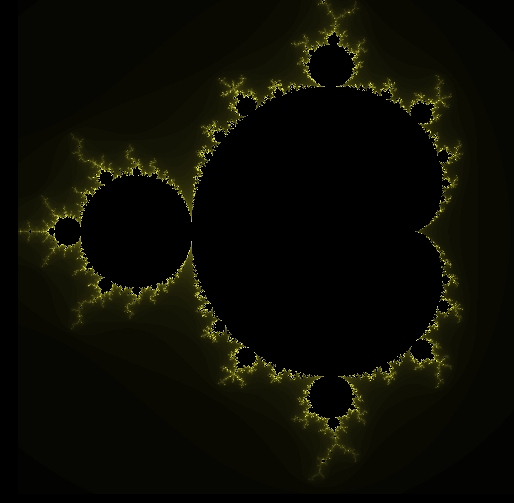

js-mandelbrot
=============

Crude Mandelbrot fractal zoomer in JavaScript.

Click area to zoom somewhere around there - this isn't currently accurate.

After zooming in for a while, floating point accuracy runs out. Should either use a library for handling very small numbers, or create a dynamic scaling logic for numbers (performance-wise probably would make more sense, should be more scalable, but might hit the same problem again after a while.)

It's a test / POC, so the code is currently a bit messy & all over global scope. If you like, just refactor it, but it's easier to develop this way in it's current state.
